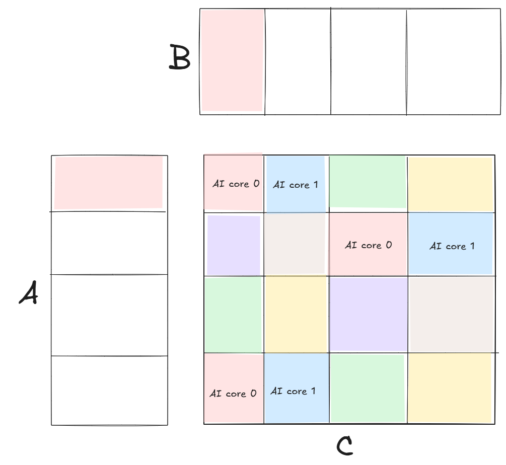
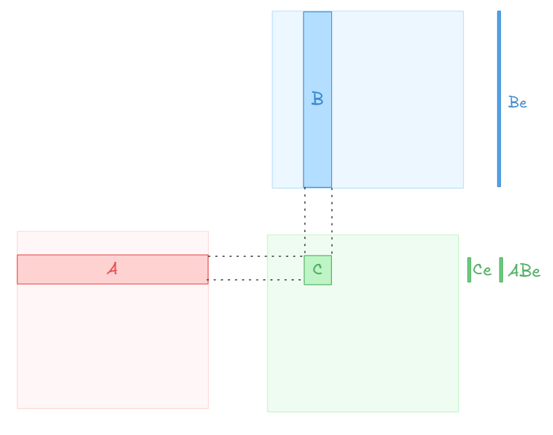
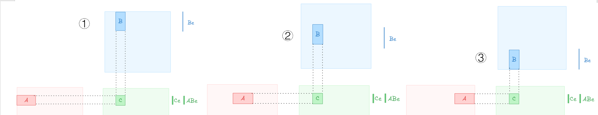
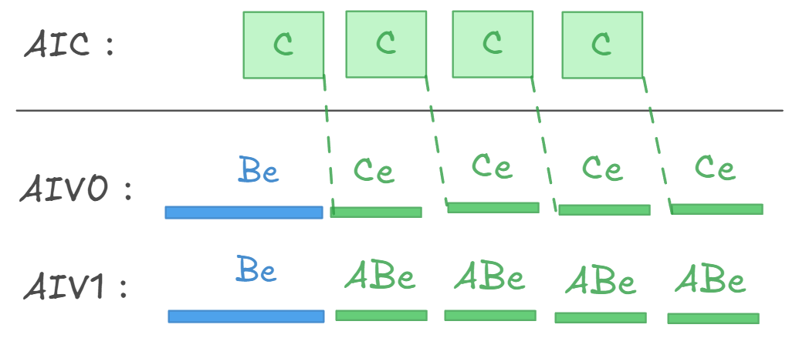

# 容错矩阵乘法

这是针对华为昇腾 910B2 NPU 的带容错校验的矩阵乘法算子。NPU 上的 CUBE 核在计算矩阵乘法的同时，VECTOR 核计算校验和，并在 CUBE 核计算完成后与矩阵乘法的真实结果作比较。

## 一、校验算法
校验和计算过程是：

$$
C^f = \begin{bmatrix}A\end{bmatrix} @ \begin{bmatrix}B & Be\end{bmatrix} 
    = \begin{bmatrix}C & Ce\end{bmatrix}, C = AB
$$C

$Ce$ 可以直接对 $C$ 求行和得到。因为 $C=AB$，可以先计算 $B$ 的行和 $Be$，再与 $A$ 相乘得到用来检验 $Ce$ 的 $ABe$。如果 $Ce$ 与校验和 $ABe$ 的差值在可接受范围内，则认为 NPU 没有硬件故障。无故障情况下，$Ce$ 与 $ABe$ 的差值主要由 NPU 浮点计算过程中的舍入误差导致。

## 二、算法实现

对于 $C=AB$，算法会把 $C$切分成子块分别进行计算与校验，[分配任务时](../../include/catlass/gemm/block/block_swizzle.hpp)会依次把 $C$ 的子块分给每一个 AI Core，让每个 AI Core 计算核校验的子块数接近。任务切分大致如下图所示。



AI Core 在对 $C$ 的子块做校验时，如果只在计算得到完整的 $C$ 子块后才作校验，即校验规模为 nb * nb * k 的矩阵乘法，则因为 k 维度太大，浮点计算舍入误差会极大地累计。即使没有硬件故障，此时得到的 $Ce$ 与 $ABe$ 也会出现显著的误差，无法达到检测故障的目的。如下图所示。



此时，需要按 k 轴切分做校验，即每次仅校验规模为 nb * k' * nb 的矩阵乘法。此时计算校验和过程中的舍入误差会降低，使得在比较 $Ce$ 和 $ABe$ 时更容易发现硬件故障导致的计算错误。如下图所示。



910B2 NPU 上有 24 个 AI Core，每个包含 1 个 Cube 核和 2 个 Vector 核。算法把 $C=AB$ 的计算分配给 AI Core 的 Cube 核，两个 Vector 核先合力计算所有的 $Be$，把结果写入全局内存，之后 Vector0 核接收 Cube 核的结果计算 $Ce$ 并写入全局内存，Vector1 核接收 $Be$ 的计算结果，计算 $ABe$ 并写入全局内存。如下图所示。



## 三、使用方法

``` bash
git clone https://gitee.com/djhuang_1/catlass.git
cd catlass
bash scripts/build.sh 03_matmul_fault --clean
./build/examples/03_matmul_fault/03_matmul_fault 4096 4096 4096 1 3
```

`03_matmul_fault` 有四个参数：`m`，`n`，`k`，`checkSumType`，`deviceId`。  
- `m`、`n`、`k`是矩阵乘法的规模；  
- `checkSumType`是校验的种类。`0`：不做校验，`1`：行校验，比较 $ABe$ 与 $Ce$；  
- `deviceId`是使用的 NPU ID。

运行结果：
``` bash
checkSumType: 2, eTA_index: 0, Be_index: 131072, eTAB_index: 131072, ABe_index: 262144, eTC_index: 262144, Ce_index: 393216
m: 4096, n: 4096, k: 4096, 77.114405 TFLOPS, 1.782273 ms, repeat: 100
Compare success.
```
无其他输出表示 $ABe$ 与 $Ce$校验通过，Compare success 指 C 的结果校验通过。因为校验C时是CPU计算矩阵乘，尺寸较大，比如4096时，校验非常慢。

## 四、性能精度数据

### 1. 算子性能

**还未开发完成，算子性能与精度并未测量**

### 2. 基线矩阵乘法接口性能

基线矩阵乘法接口是 [aclnnMatmul](https://www.hiascend.com/document/detail/zh/CANNCommunityEdition/82RC1alpha002/API/aolapi/context/aclnnMatmul.md)，测量得到的性能数据如下。测量时先预热 20 次，后测量 100 次矩阵乘法的时间取均值。[测试代码](https://gitee.com/djhuang_1/aclnn-matmul)

#### float (aclDataType::ACL_FLOAT)
| m | n | k | 性能 (TFLOPS) |
|---|---|---|---------------|
| 1024 | 1024 | 1024 | 0.562791 |
| 2048 | 2048 | 2048 | 4.146666 |
| 4096 | 4096 | 4096 | 67.461019 |
| 8192 | 8192 | 8192 | 84.159044 |
| 16384 | 16384 | 16384 | 84.933628 |

#### aclFloat16 (aclDataType::ACL_FLOAT16)
| m | n | k | 性能 (TFLOPS) |
|---|---|---|---------------|
| 1024 | 1024 | 1024 | 3.624322 |
| 2048 | 2048 | 2048 | 23.645396 |
| 4096 | 4096 | 4096 | 177.081009 |
| 8192 | 8192 | 8192 | 275.642638 |
| 16384 | 16384 | 16384 | 307.317071 |

#### aclFloat16 (aclDataType::ACL_BF16)
| m | n | k | 性能 (TFLOPS) |
|---|---|---|---------------|
| 1024 | 1024 | 1024 | 3.712293 |
| 2048 | 2048 | 2048 | 23.887100 |
| 4096 | 4096 | 4096 | 174.484221 |
| 8192 | 8192 | 8192 | 278.087550 |
| 16384 | 16384 | 16384 | 306.734805 |


## 五、TODO

- 现在还是 CPU 做的校验
- 优化性能


